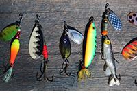

## Select projects

### Data analysis

 [LOST transcript analysis](https://github.com/cookm346/lost_transcript_analysis) 

Analysis of transcripts form the hit tv show Lost

 

 [Professional boxer analysis](https://github.com/cookm346/empirical_bayes_boxing) 

In this analysis I use Empirical Bayesian techniques to better estimate a boxer's win rate. This technique is especially effective for boxer's who have a very small number of boxing matches under their belt

 

 [Master angler analysis](https://github.com/cookm346/master_angler_analysis) 

I scrape 400,000+ trophy fish records from Manitoba and analyze fish catching trends over time, women's involvement in sport fishing, as well as find several hot fish/lake/season combos for catching big fish

 

 

### Machine learning projects

 [Bob Ross IMDb rating predictions](https://github.com/cookm346/bob_ross_imdb) 

I use several machine learning models to predict IMDb episode ratings for Bob Ross' The Joy of Painting episodes

 

 [LOST IMDb episode rating prediction](https://github.com/cookm346/lost_episode_analysis) 

I use several machine learning models to predict IMDb episode ratings from text descriptions of Lost episodes as well as analyze the defining words of each season

 

 

### Probability simulation work

 [Birthday problem simulation](https://github.com/cookm346/birthday_problem_simulation) 

I solve the famous Birthday Problem via Monte Carlo simulation

 

 [Monty Hall simulation](https://github.com/cookm346/monty_hall_simulation) 

I solve the Monty Hall problem through simulation showing why you should always "switch"

 

### Statistics simulation work
- [Median split simulations](https://github.com/cookm346/median_split_simulation)
- [t-test simulations](https://github.com/cookm346/t_test_simulation)

 

 [Computing Fibonacci numbers using eigenvectors](https://github.com/cookm346/eigenfibs) 

I show how to represent the algorithm that generate fibonacci numbers as a matrix, then use a linear alegbra method called eigendecomposition to generate any fibonacci number without having to compute the preceding numbers in the series

 

 
 
 
